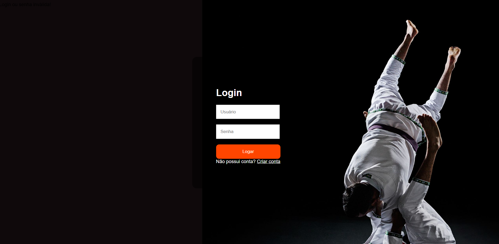

# PROJETO_JIUJITSU
Projeto Integrador - Este repositório é referente a uma atividade avaliativa prática do Curso de Análise e Desenvolvimento de Sistemas.
Aqui, inclui-se hospedagem de uma página web, banco de dados, e demais informações.
Responsáveis: Vanessa Favero , Jeferson Alves- Uniopet

Este site foi desenvolvido como parte de um projeto em grupo, inicialmente concebido com dois colegas que praticam jiu-jitsu. Utilizei o Bootstrap para o design do front-end e implementei a funcionalidade
de login e cadastro utilizando PHP e MySQL para o gerenciamento de dados.Ao acessar a página inicial do site, você será automaticamente direcionado para a tela de login. Isso ocorre porque é necessário ter uma conta para utilizar o site. Neste semestre do curso implementamos, um formulário mais completo, com as devidas requisições tais como conexão com o banco de dados, verficação de informações como e-mail digitado corretamente, funcionalidade de busca do CEP do usuário, alterar os dados etc.

Obs: a aba de vídeos funciona somente para vermos a funcionalidade de inserção de dados recentes para oa mais antigos e vice versa. 
Para executá-lo é necessário que você tenha o XAMPP instalado em seu computador, ative em seguida as duas opções: Apache e  MySQL. Feito isto digite no navegador de sua preferência :
http://localhost/modificado/

Também é necessário a criação da pasta e o banco  no PHPADMIN, para que a aplicação possa ser executada. 
Este repositório inclui os arquivos iniciais para a execução da aplicação web no momento, futuras modificações serão aplicadas e sinalizadas em uma nota explicativa.

----------------------------------------------------------------------------------------------------------------------------------------------------------------------------------------------------------------------

<h2 align="center"> Telas de apresentação </h2>

